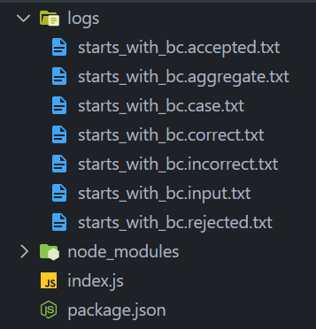
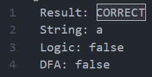
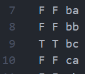

<div align="center"> <h1>Fauton</h1> </div>
<div align="center"><b>An ecosystem of packages to work with automatons(dfa/nfa/e-nfa/regex/cfg) written in typescript</b></div>

</br>

<p align="center">
  <a href="www.npmjs.com/package/fauton">
    
  </a>
  <a href="https://github.com/Devorein/fauton/actions?query=workflow%3A%22Lint%2C+Build+and+Test%22"></a>
  <a href="https://app.codecov.io/gh/Devorein/fauton"></a>
  
  
  
  
  
</p>

- [Features](#features)
- [Examples](#examples)
  - [Testing regular expressions](#testing-regular-expressions)
  - [Generate language of a CFG](#generate-language-of-a-cfg)
  - [Remove null production from CFG](#remove-null-production-from-cfg)
  - [Removing all unreachable production rules from CFG](#removing-all-unreachable-production-rules-from-cfg)
- [Conditions for DFA](#conditions-for-dfa)
- [Transitions Record Transformation](#transitions-record-transformation)
  - [dfa](#dfa)
  - [nfa](#nfa)
  - [ε-nfa](#ε-nfa)
- [Input string generation](#input-string-generation)
  - [Reading from a file](#reading-from-a-file)
  - [Custom array of strings](#custom-array-of-strings)
  - [Generating random strings](#generating-random-strings)
  - [Generating all combinations of certain length](#generating-all-combinations-of-certain-length)
- [Generated artifact files](#generated-artifact-files)
  - [Sample artifact files](#sample-artifact-files)
  - [`<fa.label>.accepted.txt`](#falabelacceptedtxt)
  - [`<fa.label>.aggregate.txt`](#falabelaggregatetxt)
  - [`<fa.label>.case.txt`](#falabelcasetxt)
  - [`<fa.label>.correct.txt`](#falabelcorrecttxt)
  - [`<fa.label>.incorrect.txt`](#falabelincorrecttxt)
  - [`<fa.label>.input.txt`](#falabelinputtxt)
  - [`<fa.label>.rejected.txt`](#falabelrejectedtxt)
- [Terminal Output](#terminal-output)
  - [Sample terminal output](#sample-terminal-output)
  - [Incorrect Portion](#incorrect-portion)
  - [Correct Portion](#correct-portion)
- [Algorithm Sources](#algorithm-sources)
- [Credits](#credits)
- [Contributors](#contributors)

**Please note that I won't be following semver at the initial stages, as there could be a lot of (breaking) changes between each release which will all be patch**

# Features

1. Full typescript support
2. Easy to use api
3. High test coverage
4. Supports both node and browser environment (except a few)

# Examples

## Testing regular expressions

Rather than testing only a finite automaton, you can also test your regular expressions against generated strings

```js
import { FiniteAutomataTest, RegularExpression } from 'fauton';
import path from 'path';

const regex = new RegularExpression(
	(inputString) => {
		return (
			inputString[0] === 'a' &&
			inputString[1] === 'b' &&
			inputString
				.slice(2)
				.split('')
				.every((char) => char === 'c')
		);
	},
	{
		alphabets: ['a', 'b', 'c'],
		label: 'Starts with a and b, ends with any number of c',
		regex: /^abc*$/g,
	}
);

const finiteAutomataTest = new FiniteAutomataTest(path.join(__dirname, 'logs'));

finiteAutomataTest.test([
	{
		automaton: regex,
		options: {
			type: 'generate',
			combo: {
				maxLength: 10,
			},
		},
	},
]);
```

## Generate language of a CFG

Lets try to generate all the possible strings of the language of a CFG up to a certain length

```js
import { GenerateString } from 'fauton';

const cfgLanguage = GenerateString.generateCfgLanguage(
	{
		startVariable: 'S',
		terminals: ['0', '1', '+', '-', '/', '*', '(', ')'],
		productionRules: {
			S: ['S', 'SEN', '(S)', 'N'],
			N: ['0', '1'],
			E: ['+', '-', '/', '*'],
		},
		variables: ['S', 'N', 'E'],
	},
	3
);
console.log(Object.keys(cfgLanguage));
```

```sh
[
  '0',   '1',   '(1)', '(0)',
  '1*1', '1+0', '0+0', '1/0',
  '0/0', '1/1', '0/1', '1-1',
  '0-1', '1*0', '0*0', '1-0',
  '0-0', '1+1', '0+1', '0*1'
]
```

## Remove null production from CFG

```js
import { ContextFreeGrammarUtils } from 'fauton';
const nullProductionRemovedTransition = ContextFreeGrammarUtils.removeNullProduction({
	productionRules: {
		S: ['ABAC'],
		A: ['aA', ''],
		B: ['bB', ''],
		C: ['c'],
	},
	variables: ['S', 'A', 'B', 'C'],
	startVariable: 'S',
});
console.log(nullProductionRemovedTransition);
```

```sh
# Notice that there are no production rules that produces epsilon values
{
  S: ['AAC', 'ABAC', 'ABC', 'AC', 'BAC', 'BC', 'C'],
  A: ['aA', 'a'],
  B: ['bB', 'b'],
  C: ['c']
}
```

## Removing all unreachable production rules from CFG

```js
import { ContextFreeGrammarUtils } from 'fauton';

console.log(
	ContextFreeGrammarUtils.removeUnreachableProduction({
		productionRules: {
			S: ['AB'],
			A: ['aA', 'a'],
			B: ['bB', 'b'],
			C: ['cC', 'c'],
		},
		startVariable: 'S',
		variables: ['S', 'A', 'B', 'C'],
	})
);
```

```sh
{
  productionRules: {
    S: ['AB'],
    A: ['aA', 'a'],
    B: ['bB', 'b'],
  },
  variables: ['S', 'A', 'B'],
}
```

Take a look at [examples](./examples) folder for more examples.

# Conditions for DFA

Deterministic finite automaton must follow certain conditions for it to be considered as one. These are described below

1. `transitions` record must contain all the elements of `states` array as its key
2. Only the items of the `states` can be the key of the `transitions` record
3. `transitions` record values must either be an array or the string literal `loop`
4. If its an array its length should be the same `alphabets` array, where each index represents which state to transition to when encountering a symbol (index of the `alphabets` array)
5. Also if its an array each item should be a string as for a single symbol a dfa can transition to only one state
6. `transitions` record values can only have `symbols` that are present in the `alphabets` array

# Transitions Record Transformation

## dfa

All the states of the dfa must have transitions for all the input symbols.

```json
{
	"final_states": ["A", "B", "C"],
	"alphabets": ["0", "1", "2"],
	"transitions": {
		"A": ["B", "C", "A"],
		"B": ["C", "A", "C"],
		"C": "loop"
	}
}
```

For the above automaton, the `transitions` record will be transformed like the following:-

```js
{
	"A": {
		"0": "B",
		"1": "C",
		"2": "A",
	},
	"B": {
		"0": "C",
		"1": "A",
		"2": "C",
	},
	"C": {
		"0": "C",
		"1": "C",
		"2": "C",
	},
};
```

## nfa

```json
{
	"alphabets": ["a", "b", "c"],
	"states": ["A", "B", "C"],
	"transitions": {
		"A": ["B", null, "B"],
		"B": [null, "C"],
		"C": [null, null, "C"]
	}
}
```

Since its a nfa the conditions of `transitions` record for dfa is not applicable here

```js
{
  "A": {
    "a": ["B"],
    "c": ["B"]
  },
  "B": {
    "b": ["C"]
  },
  "C": {
    "c": ["C"]
  }
}
```

## ε-nfa

```json
{
	"alphabets": ["a", "b", "c"],
	"states": ["A", "B", "C"],
	"transitions": {
		"A": ["B", null, "B"],
		"B": [null, "C"],
		"C": [null, null, "C"]
	},
	"epsilon_transitions": {
		"A": ["B"]
	}
}
```

Transformed transitions record

```js
{
  A: { a: [ 'B', 'C' ], c: [ 'B', 'C' ], b: [ 'C' ] },
  B: { b: [ 'C' ], a: [], c: [ 'C' ] },
  C: { c: [ 'C' ] }
}
```

# Input string generation

When testing the finite automaton using the `FiniteAutomataTest` class object's `test` method there are four ways to provide input strings to the automaton and the logic test callback

## Reading from a file

If you already have a file that contains a bunch of input strings made of valid symbols of the automata you can load that file and feed each strings (delimited by a newline) to the automata and logic test.

```js
finiteAutomataTest.test([
	{
		automaton,
		options: {
			type: 'file',
			// Path to the input file
			filePath: path.join(__dirname, 'input.txt'),
		},
	},
]);
```

## Custom array of strings

You can provide your own custom array of strings to feed to the automaton and logic test callback.

```js
finiteAutomataTest.test([
	{
		automaton,
		options: {
			type: 'custom',
			inputs: ['101', '110', '00101'],
		},
	},
]);
```

## Generating random strings

You can feed automaton and logic test callback a set of unique randomly generated strings from the alphabet of the automaton

```js
finiteAutomataTest.test([
	{
		automaton,
		options: {
			type: 'generate',
			random: {
				// Maximum length of the random string
				maxLength: 4,
				// Minimum length of the random string
				minLength: 2,
				// Total unique random strings
				total: 5,
			},
		},
	},
]);
```

## Generating all combinations of certain length

You can also feed your automaton and logic test callback all the combinations of the alphabet of certain length

```js
finiteAutomataTest.test([
	{
		automaton,
		options: {
			type: 'generate',
			combo: {
				maxLength: 3,
			},
		},
	},
]);
```

If your alphabet is `a,b` then it will generate the following set of strings

```sh
a, b, aa, bb, ab, ba, aaa, aab, aba, abb, bbb, bba, bab, baa
```

# Generated artifact files

After running the test, artifact files will be generated in the folder specified in the `FiniteAutomataTest` class constructor. These files contain additional information about the test and starts with the label of the dfa.

## Sample artifact files

Sample artifact files shown inside `logs` directory



## `<fa.label>.accepted.txt`

Contains all the strings that will be accepted by the automaton


## `<fa.label>.aggregate.txt`

Contains an aggregated result of the test. Its similar to what is shown in the terminal. See [Terminal Output](#terminal-output)


## `<fa.label>.case.txt`

Contains detailed results for each input string test case.



- Result: `CORRECT` if `fa.result == logic.result`, `WRONG` otherwise
- String: Input string
- Logic: `logic.result`
- FA: `fa.result`

## `<fa.label>.correct.txt`

Contains all the strings that generated the same boolean result from the logic test callback and the automaton.



- First column: `fa.result`
- Second column: `logic.result`
- Third column: Input string

## `<fa.label>.incorrect.txt`

Contains all the strings that generated different boolean result from the logic test callback and the automaton

Same as `<fa.label>.correct.txt`

## `<fa.label>.input.txt`

Contains all the input strings. Useful when you are generating random or combo strings and want to reuse it for later

Same as `<fa.label>.accepted.txt`

## `<fa.label>.rejected.txt`

Contains all the strings that have been rejected by the automaton

Same as `<fa.label>.accepted.txt`

# Terminal Output

While the test is proceeding the progress will be shown in the terminal, and once its done an aggregated result of the test will be shown as below.

## Sample terminal output


- `fa.result`: Indicates the result from the finite automata
- `logic.result`: Indicates the result from the logic test

The progress bar shows the number of input strings that's been processed. Beneath that the label, description and the total number of input strings are shown

## Incorrect Portion

- `Incorrect`: Total number of strings where the automaton and logic test gave different result. Conditions:-
  - `fa.result = false && logic.result = true`
  - `fa.result = true && logic.result = false`
- `Incorrect(%)`: Percentage of strings that are incorrect out of all strings
- `False Positives`: Total number of strings that didn't pass the logic test but passed the automata test. Condition:-
  - `fa.result = true && logic.result = false`
- `False Positives(%)`: Total number of false positives out of all strings
- `False Negatives`: Total number of strings that passed the logic test but didn't pass the automata test. Condition:-
  - `fa.result = false && logic.result = true`
- `False Negatives(%)`: Total number of false negatives out of all strings

## Correct Portion

- `Correct`: Total number of strings where the automaton and logic test gave same result. Conditions:-
  - `fa.result = true && logic.result = true`
  - `fa.result = false && logic.result = false`
- `Correct(%)`: Percentage of strings that are correct out of all strings
- `True Positives`: Total number of strings that passed both the logic and automata test. Condition:-
  - `fa.result = true && logic.result = true`
- `True Positives(%)`: Total number of true positives out of all strings
- `True Negatives`: Total number of strings that didn't pass both the logic and automata test. Condition:-
  - `fa.result = false && logic.result = false`
- `True Negatives(%)`: Total number of true negatives out of all strings

Better and more detailed api documentation coming soon very soon.

# Algorithm Sources

Wikipedia sources for all the algorithms used in the package

1. [Thompson-McNaughton-Yamada](https://en.wikipedia.org/wiki/Thompson%27s_construction) algorithm for converting regex to e-nfa
2. [Hopcroft](https://en.wikipedia.org/wiki/DFA_minimization#Hopcroft's_algorithm) algorithm for dfa-minimization
3. [Rabin–Scott powerset construction](https://en.wikipedia.org/wiki/Powerset_construction) algorithm to convert nfa to dfa
4. [Shunting-Yard](https://en.wikipedia.org/wiki/Shunting-yard_algorithm) algorithm to convert regex string from infix to postfix
5. [Chomsky Normal Form](https://en.wikipedia.org/wiki/Chomsky_normal_form) Algorithm to make parsing a string easier
6. [Cocke–Younger–Kasami](https://en.wikipedia.org/wiki/CYK_algorithm) Parsing algorithm for CFG

# Credits

Big thanks to all these wonderful repos.

1. [Orban](https://github.com/wevial/orban) Regular expression engine that uses the Thompson-McNaughton-Yamada algorithm implemented in Python.
2. [CFGChecker](https://github.com/mattany/CFGChecker) A program that cross references a context free grammar with a given language.
3. [CFG Epsilon Removal](https://eli.thegreenplace.net/2010/02/08/removing-epsilon-productions-from-context-free-grammars) A detailed article on how to remove epsilon from CFG
4. [python-formal-langs-practicum-automata-cfg](https://github.com/persiyanov/python-formal-langs-practicum-automata-cfg) Automata, Context-free-grammar classes (implementation of CYK algorithm, converting grammar to Chomsky normal form, Thompson algo for building automaton from regex, etc.)

# Contributors

1.  Safwan Shaheer [github](https://github.com/Devorein) Author, Maintainer

Feel free to submit a pull request or open a new issue, contributions are more than welcome.
